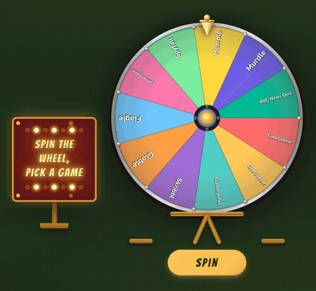
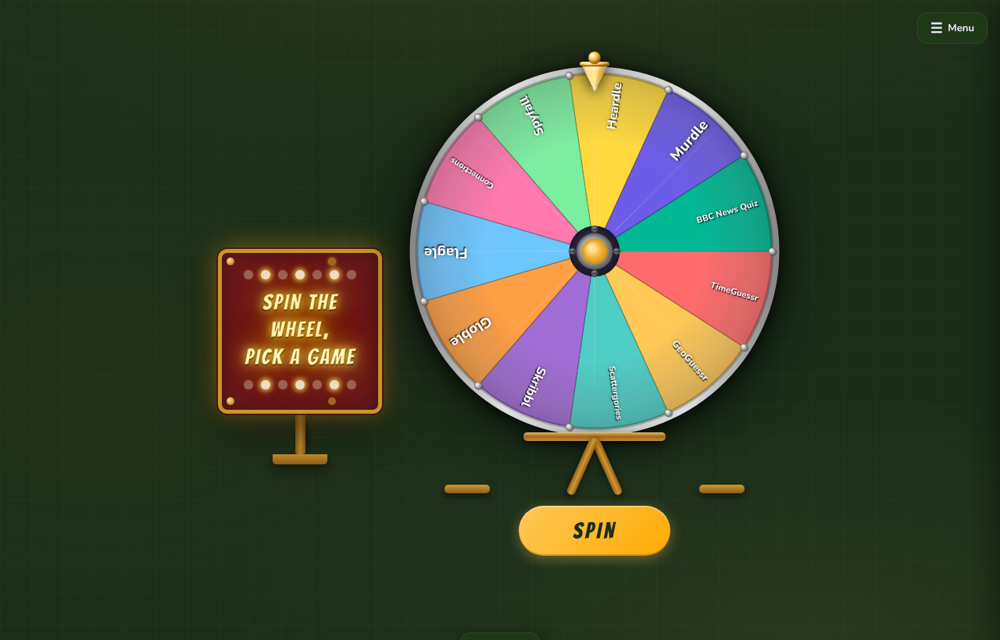
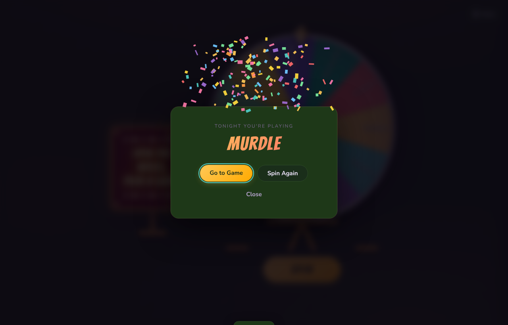
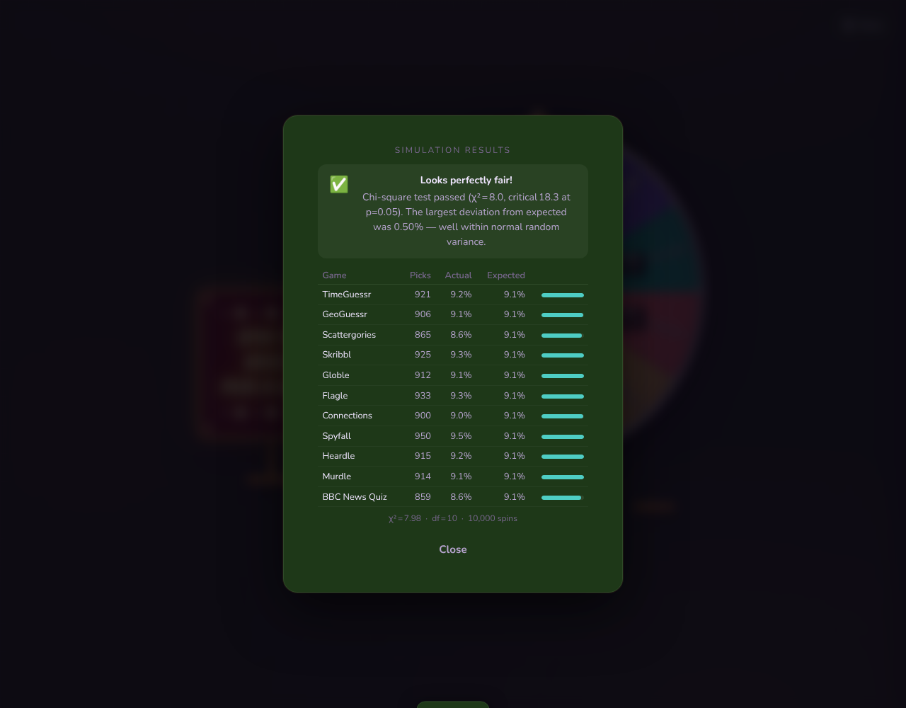
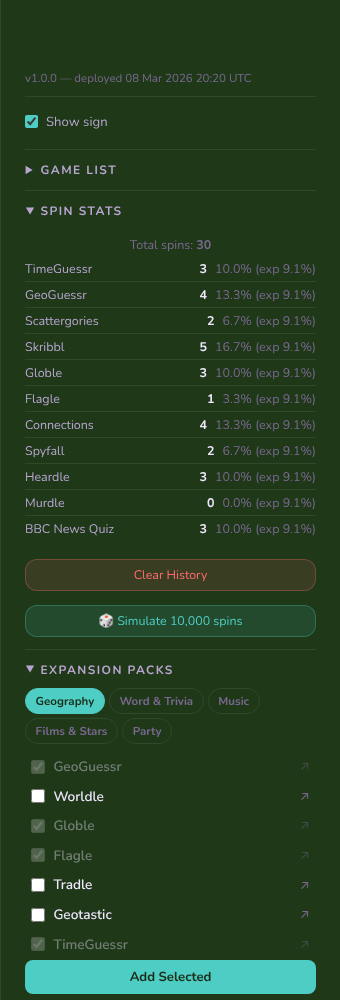
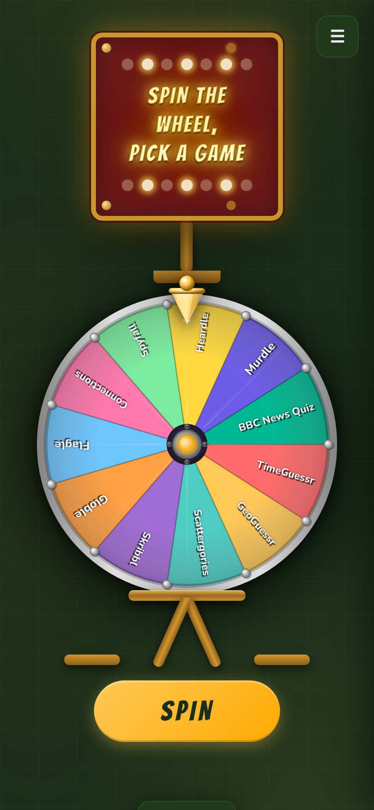
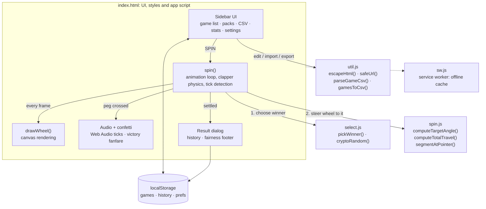

<div align="center">

# 🎡 GameChanger Wheel

### Stop arguing about what to play. Spin for it.

A carnival-style prize wheel that picks tonight's online game for your group: fairly, dramatically, and with confetti.

[**▶ Spin it live → gamechanger-wheel.netlify.app**](https://gamechanger-wheel.netlify.app)




</div>

---

## Why?

Every game night starts with the same five-minute standoff: *"I don't mind, what do you want to play?"* GameChanger ends it. Load the wheel with your group's favourite browser games, hit **SPIN**, and let fate decide. Every game gets an equal shot, and you can check that for yourself.

## ✨ Features

| | |
|---|---|
| 🎡 **Physical-feeling wheel** | Canvas-rendered with a metallic rim, studs and a gold hub. Each spin picks a random easing curve, then the wheel settles with a spring wobble. |
| 🔊 **Synthesised clapper** | Every peg the pointer hits plays a woody *thwack* generated live with the Web Audio API. It gets softer as the wheel slows. No audio files. |
| 🎉 **Big reveal** | A victory arpeggio, confetti, and a one-click **Go to Game** link. |
| 🎲 **Fair by construction** | The winner is drawn first with `crypto.getRandomValues`, then the wheel is steered to land on it. Segment size and spin physics can't bias the result. |
| 📊 **Prove it** | Spin Stats tracks every pick. **Simulate 10,000 spins** runs a chi-square goodness-of-fit test on the spot. |
| 📦 **Expansion packs** | One-tap packs for Geography, Word & Trivia, Music, Films & Stars and Party games. |
| ✍️ **Your list, your rules** | Add custom games, toggle any on or off, and import/export CSV. Everything is saved in `localStorage`. |
| ♿ **Accessible** | Full keyboard control, screen-reader announcements, focus management, high-contrast focus rings, and a *Reduce motion* mode that really does calm the spin. |
| 📱 **Installable PWA** | Works offline after the first visit. Add it to your home screen like a native app. |

## 📸 Screenshots

<table>
  <tr>
    <td colspan="2"></td>
  </tr>
  <tr>
    <td width="50%"><br><sub><b>The reveal:</b> confetti, fanfare and a direct link to the game.</sub></td>
    <td width="50%"><br><sub><b>Trust, but verify:</b> 10,000 simulated spins and a chi-square test.</sub></td>
  </tr>
  <tr>
    <td width="50%" align="center"><br><sub><b>Sidebar:</b> per-game stats and expansion packs.</sub></td>
    <td width="50%" align="center"><br><sub><b>Mobile:</b> fully responsive, installable.</sub></td>
  </tr>
</table>

## ⌨️ Keyboard shortcuts

| Key | Action |
|---|---|
| <kbd>Space</kbd> / <kbd>S</kbd> | Spin the wheel |
| <kbd>←</kbd> <kbd>→</kbd> | Highlight wheel segments (announced to screen readers) |
| <kbd>O</kbd> | Open the highlighted segment's link, or the last winner's |
| <kbd>Esc</kbd> | Close dialogs and the sidebar |

Click any segment on the wheel to open its game.

## 🧠 How it works



**The spin is decided before the wheel moves.** `pickWinner()` draws a uniformly random game. `computeTargetAngle()` works out the angle that puts that game under the pointer, with a random offset inside the segment so it never lands dead-centre. `computeTotalTravel()` adds a whole number of extra turns (6–15) so the wheel lands exactly there. Everything after that is theatre: the easing curve, the clapper and the wobble are all cosmetic. While a spin is in flight the wheel's segments are frozen, so editing the list mid-spin can't move the landing spot.

## 🗂️ Project structure

```
index.html      UI markup, styles and the main app script (rendering, audio, UI)
spin.js         Pure wheel-angle maths
select.js       Cryptographically random winner selection
util.js         HTML escaping, URL sanitising, CSV parse/serialise
sw.js           Service worker for offline / PWA support
manifest.json   PWA manifest
*.test.js       Vitest unit tests
docs/images/    README screenshots and GIF
```

## 🚀 Getting started

No build step and no framework, just static files.

```bash
git clone https://github.com/chrisbrooksbank/gamechanger.git
cd gamechanger
npx serve .          # or any static server, then open the printed URL
```

> Serve the folder over HTTP rather than opening `index.html` from disk. The app uses ES modules and a service worker, and neither works on `file://`.

### Run the tests

```bash
npm install
npm test             # vitest: spin maths, winner fairness, escaping, URL + CSV handling
```

## 📥 CSV format

One game per line, with an optional link. Lines starting with `#` are ignored, and names containing commas can be quoted:

```csv
# My game night
Codenames,https://codenames.game/
"Rock, Paper, Scissors",https://rps.example/
Charades
```

Links must be `http(s)`. Bare domains like `skribbl.io` get `https://` added for you.

## ☁️ Deployment

It's a static site on [Netlify](https://gamechanger-wheel.netlify.app) with no build command. Any static host (GitHub Pages, Cloudflare Pages, S3) works the same way. When you ship changes, bump `CACHE` in `sw.js` so installed copies pick up the update; the app shows an *Update available* toast.

## 📄 License

[MIT](LICENSE). Spin responsibly. 🎪
